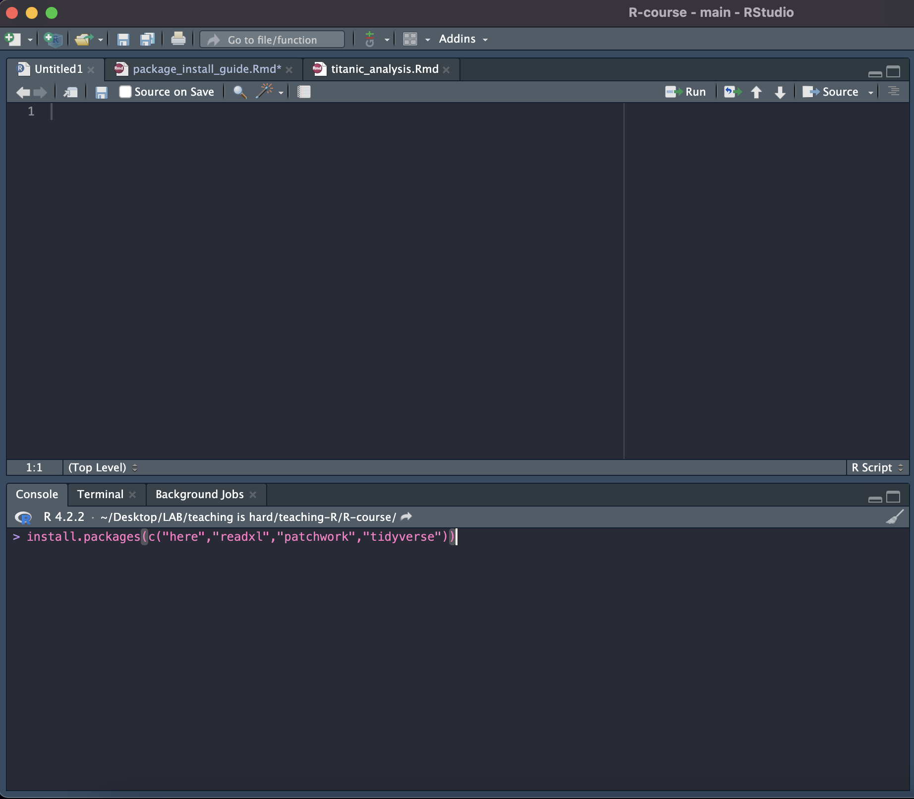
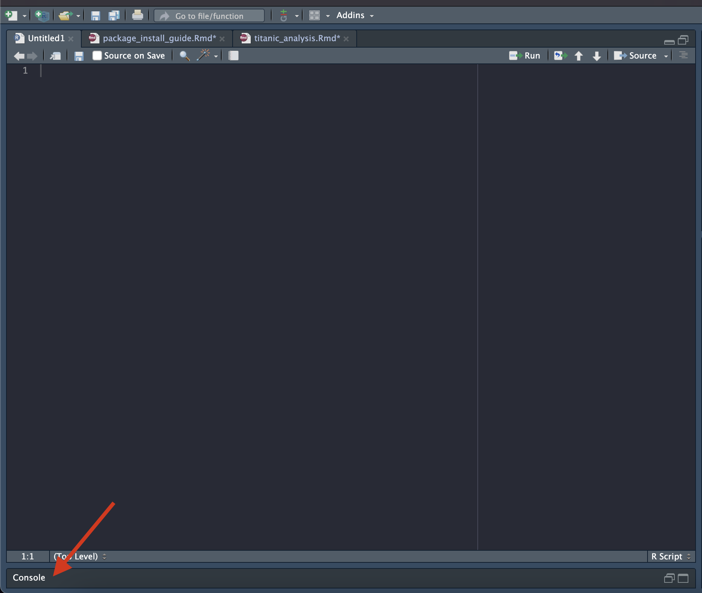
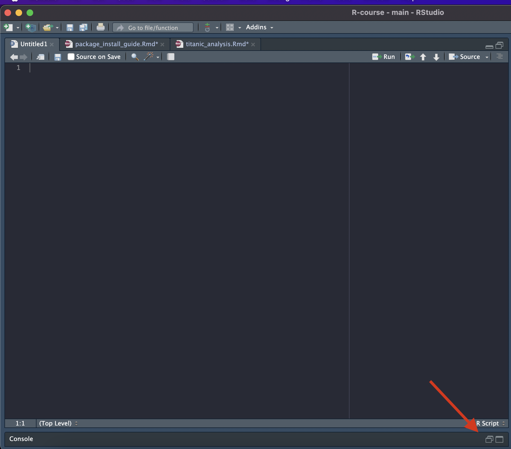
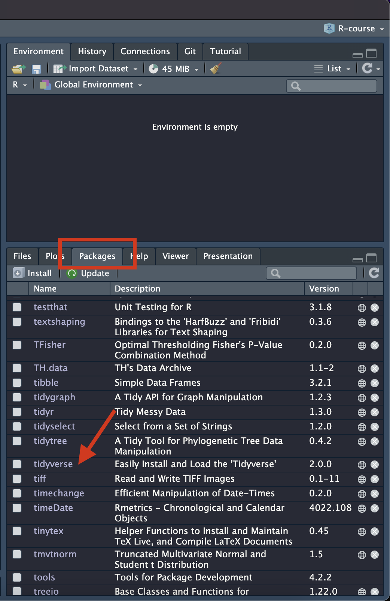
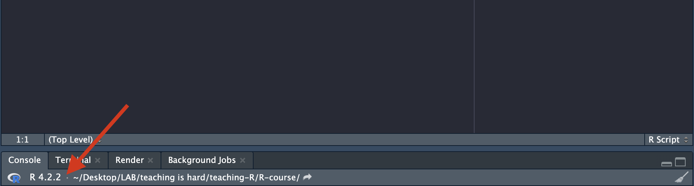
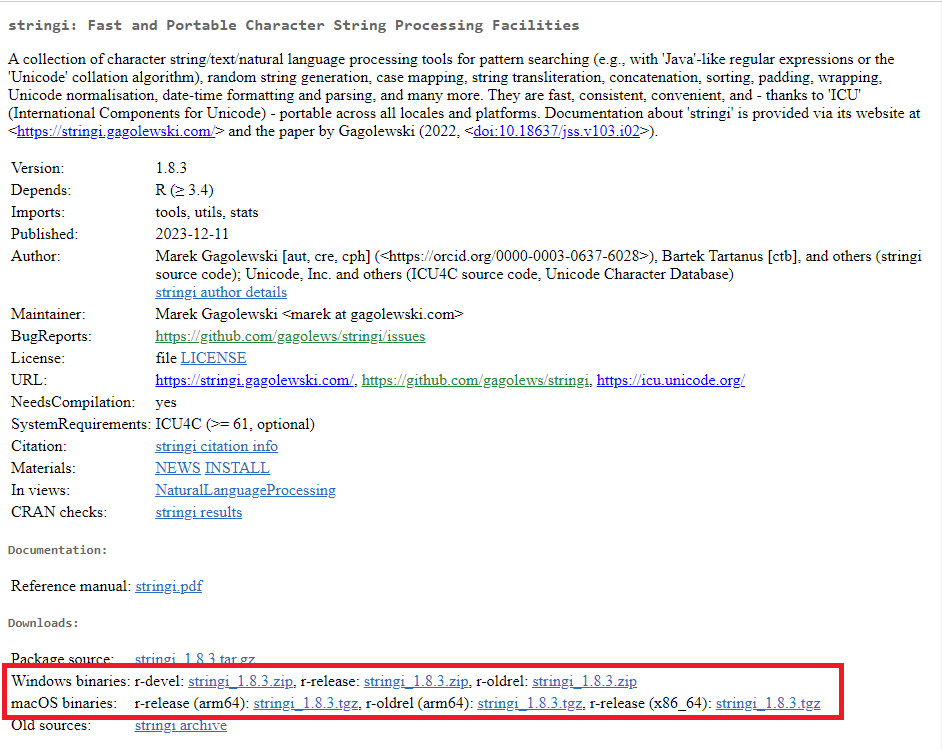
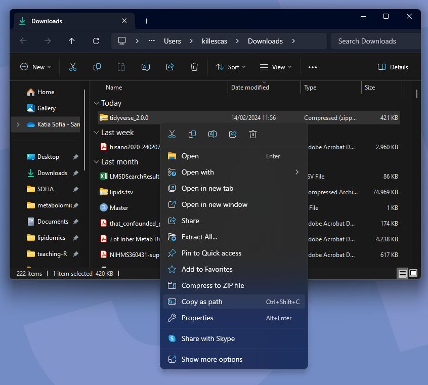

```{r setup, include=FALSE}
knitr::opts_chunk$set(echo = TRUE)
knitr::opts_chunk$set(eval=FALSE)
```

## Paquetes que vamos a usar el lunes

Todos los paquetes que vamos a usar el lunes están en CRAN, por lo que todo lo que hay que hacer es abrir RStudio y usar la función ```install.packages()```. 

Queremos instalar los siguientes paquetes:

- **here:** le dice a R que busque archivos en el directorio (carpeta) donde está guardado el proyecto que tienes abierto

- **readxl:** para importar archivos de Excel dentro de R

- **patchwork:** permite agregar muchos gráficos distintos en la misma imagen/pdf/etc.

- **tidyverse:** en realidad son varios paquetes de R que usan los mismos tipos de datos y están diseñados para trabajar en conjunto 


```{r}
install.packages(c("here","readxl","patchwork","tidyverse"))

# Las que ya instalaron here, readxl y tidyverse solo instalen patchwork por favor
```


Lo pueden escribir directamente donde dice "Console" y le dan Enter/return:

<br>

<center>{width="512"}</center>

<br> Si "Console" está minimizada como aquí: <br>

<center>{width="515"}</center>

<br> Solo hay que dar click en los cuadritos que la despliegan <br>

<center>{width="521"}</center>

<br>

Si todo salió bien, todos los paquetes deberían aparecer así en la pestaña "Packages"

<br>

<center>{width="465"}</center>

<br>

De no ser así, vean la sección [Resolver problemas] de este documento

# ¿De dónde se instalan los paquetes?

Existen varias plataformas donde se guardan los distintos paquetes de R. Todas se pueden llamar desde RStudio con diferentes funciones. 

### Comprehensive R Archive Network (CRAN)

Es el repositorio central de R que contiene la mayoría de paquetes.

Se pueden descargar como archivos binarios para Mac/Windows o como source code. Lo mejor es usar el binario, porque tarda menos.

```{r cran}
install.packages("stringi")

# En Windows y Mac se instala automaticamente del binario si existe
install.packages("stringi",type = "binary") 

# Se puede especificar usar el source pero puede que requiera otros paquetes para que funcione
install.packages("stringi",type = "source")

```

### Bioconductor

https://www.bioconductor.org/packages/release/BiocViews.html#___Software

Tiene paquetes específicamente diseñados para bioinformática. Para utilizarlo haay que descargar el paquete ```BiocManager``` de CRAN.

```{r bioconductor}

install.packages("BiocManager")

BiocManager::install("limma")
```

### GitHub

Github es una plataforma que se usa para guardar y compartir código con el público o entre un mismo equipo. Los usuarios tienen "repositorios" en los que suben sus archivos. Por ejemplo, la mía para este cursito está aquí https://github.com/sofiaillescasb/teaching-R.

Cualquiera puede subir su código y hacerlo accesible, por lo que hay paquetes de R muy especializados, pero también hay algunas versiones experimentales de paquetes que están en CRAN o en Bioconductor.

Para descargar paquetes desde GitHub hay que instalar primero el paquete ```remotes``` de CRAN y luego utilizar la función ```install_github()```. 

```{r github}

install.packages("remotes")

install_github("klutometis/roxygen")

```


##Lista de muchos paquetes útiles

Encontré esta lista en Github con paquetes buenos, pero no hace falta instalarlos, solo la pongo por si tienen curiosidad.

https://github.com/qinwf/awesome-R/blob/master/README.md

# Resolver problemas

<br> Casi todo se puede resolver con buscar el error en <https://stackoverflow.com/> e intentar las sugerencias hasta que algo funcione, pero lo funcionó con `stringi` fue:

<br> - Actualizar R si la versión no es la más nueva (<https://cran.rstudio.com/>)

<br> - La version se puede ver debajo de donde dice "Console":

<br>

<center></center>

<br>

<br> - Descargar directamente el archivo binario de su fuente (en este caso estaba en CRAN) <br>

<center>{width="545"}</center>

### Si usas MacOS:

Hay que fijarse en el tipo de archivo binario. Aunque pueden ser iguales para todos los equipos, si hay duda mira en la *manzana de la esquina superior izquierda \>* *About this Mac \> Processor:*

-   Si dice Apple silicon (ARM, M1 or M2) usa el ***arm64***

-   Si dice Intel usa ***x86/Intel***

-   Más información aquí: <https://cran.r-project.org/bin/macosx/>

Ya que descargaste el archivo, vas a Rstudio y le das:

*Tools \> Install packages*

Selecciona Package Archive File (.zip; .tar.gz) y selecciona el pathway del binario que descargaste. Esto le dice a R lo mismo que:

<br>`install.packages("PATHWAY DEL PAQUETE", repos = NULL)` , donde "PATHWAY DEL PAQUETE" es el pathway del binario que descargaste. <br> <br>

<center>{width="344"}</center>

<br> <br> - Si al hacerlo de la forma anterior sale un error que dice `type =="both" cannot be used with 'repos =NULL'` hay que usar `install.packages("PATHWAY DEL PAQUETE", repos = NULL, type="binary").`

<br>

-   El pathway se ve asi: "C:\\Users\\killescas\\Downloads\\tidyverse_2.0.0.zip" y se encuentra al dar *click derecho al archivo \> Copy as path* o *Copy as pathname*:

<br> <br>

<center>{width="63%"}</center>

<br> - IMPORTANTE: En Windows los pathways están escritos con \\, pero en R es necesario cambiarlos por /
